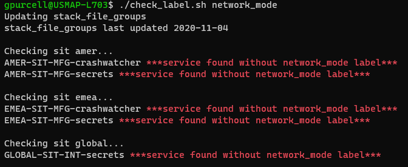

# Utility Scripts

### replace_uuid.py
###### This script replaces uuid's in the given files with new uuid's. Multiple occurrences of a unique uuid will be replaced with the same new uuid. Optionally the application name can also be replaced with a new name.

### check_label.sh
##### This script checks that the given label is present for each deployed service in the stack files.

