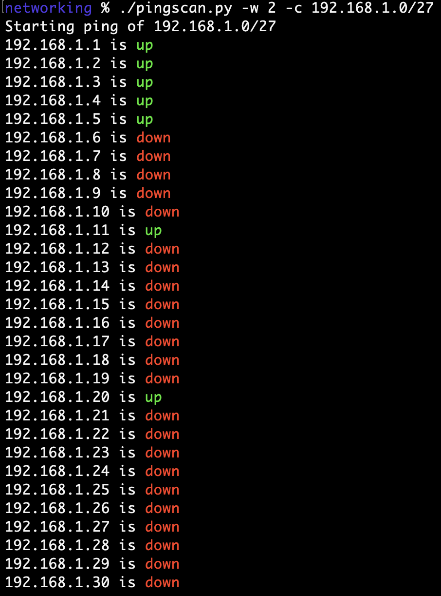
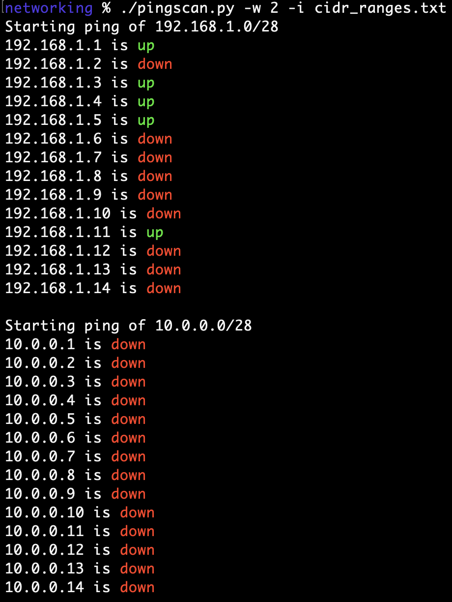
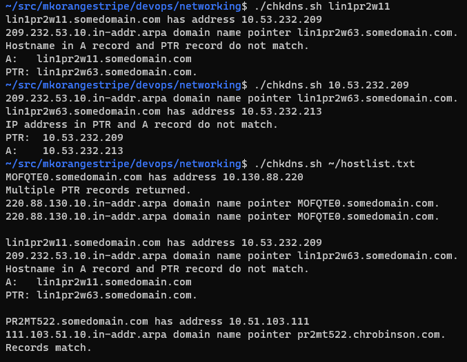

# Networking Scripts

### pingscan.py
###### Scan a network by pinging a CIDR range in parallel.
###### Single CIDR range.

###### Multiple CIDR ranges from file.

### chkdns.sh
###### Compare the A record and PTR record of a host.

